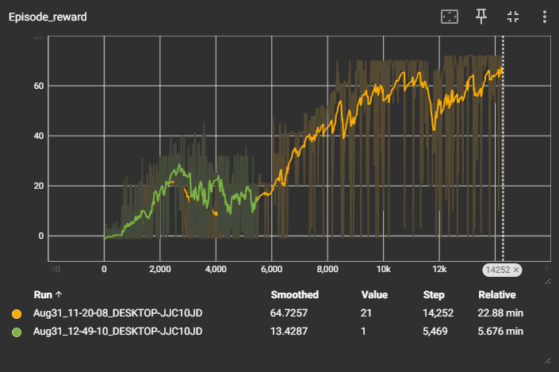

# DQN for Pathery

This project implements the Deep Q-Network (DQN) reinforcement learning algorithm for the game [Pathery](https://www.pathery.com).


- It uses Pytorch for the neural networks, Tensorboard for model training progress visualization, and my [Pathery Gymnasium](https://github.com/SandSnip3r/PatheryEnv).

## Status \[8/31/2024\]

I am currently experimenting with different model sizes, algorithm parameters, and rewards. My goal is to train the agent to be able to solve at least one "Normal" puzzle.

I plan to try a convolutional neural network. I also plan to implement action masking.

## Tensorboard Training Progress Visualization



## C++ Prioritized Experience Replay

```
pip install pybind11
cd cpp_modules
python setup.py build_ext --inplace
```